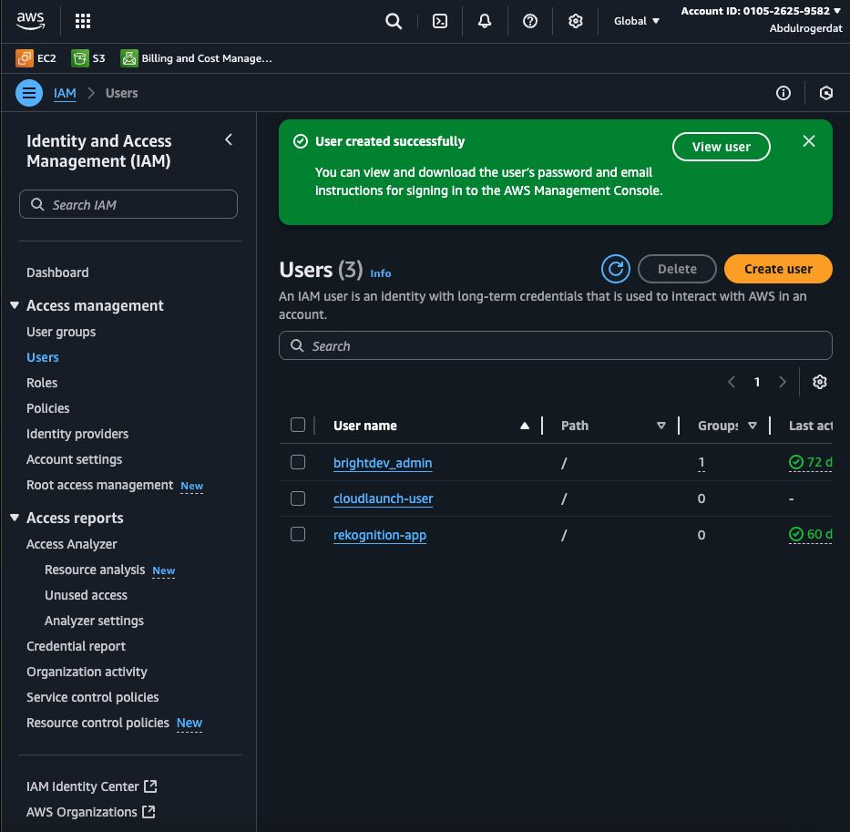
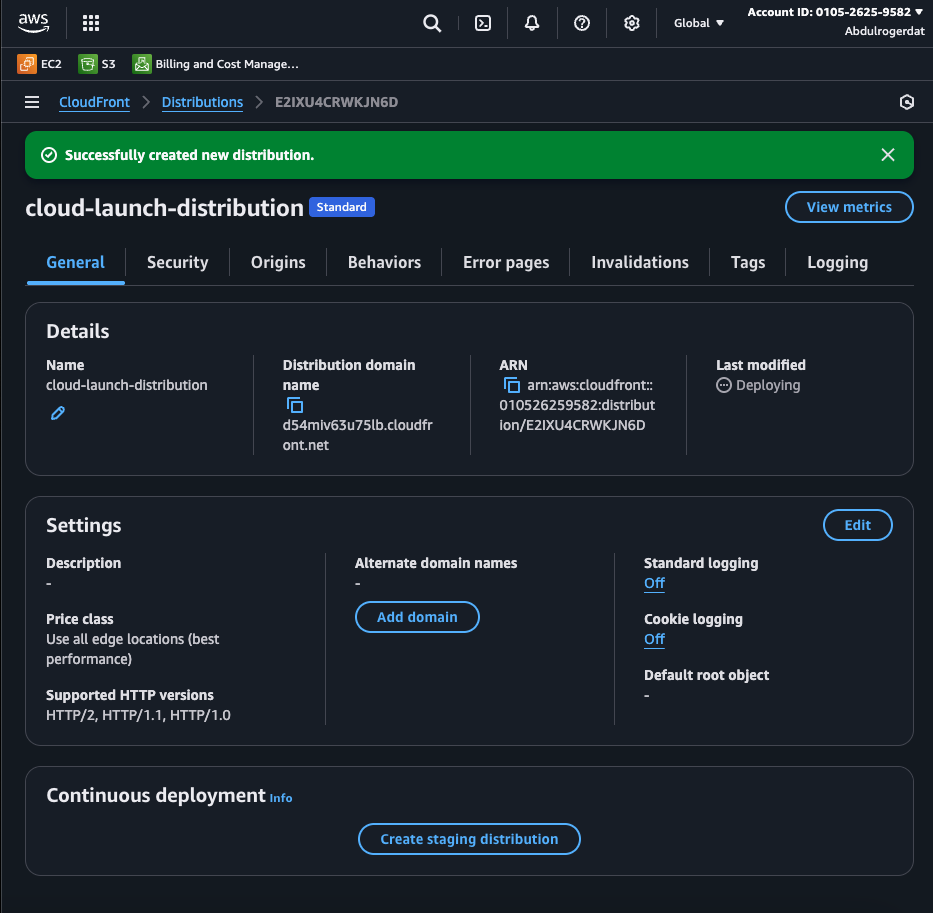
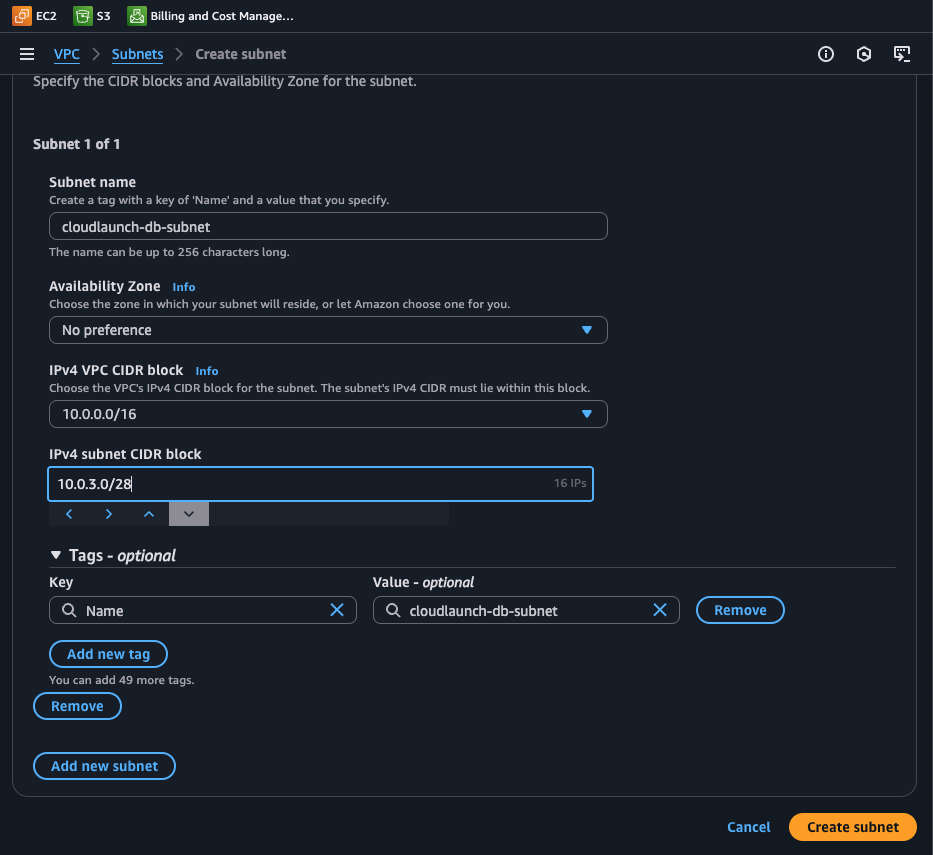

## CloudLaunch AWS Deployment Guide


A practical walkthrough for deploying a secure static site and using AWS S3, IAM, Cloudfront and VPC.

## Overview

This guide details the CloudLaunch project setup — a lightweight web platform deployed with AWS Free Tier resources. It features:

- A publicly accessible static site for the company.

- Secure internal file storage with strict permission controls.

- A future-proof VPC architecture for expansion.

Tasks covered:

- Static Website Hosting on S3 (with tailored IAM permissions)

- VPC Network Design for secure resource separation

## Submision Links

- S3 Site Link:
  [s3://abdul-cloud-launch-site-bucket/CloudLaunch/](s3://abdul-cloud-launch-site-bucket/CloudLaunch/)

  ```bash
      s3://abdul-cloud-launch-site-bucket/CloudLaunch/
  ```

- CloudFront URL:
  [d54miv63u75lb.cloudfront.net](d54miv63u75lb.cloudfront.net)

  ```bash
    d54miv63u75lb.cloudfront.net
  ```

## Task 1: Static Website Hosting and Secure File Storage

### Step 1. Create S3 Buckets

- Log in to AWS Management Console. Go to “S3” -> “Create bucket”

  

  > [!TIP]
  > Create three buckets.

### a. cloudlaunch-site-bucket (Purpose: Hosts your public static site (HTML/CSS/JS)).

Setup:

- Create bucket named anything you like in my case i use "abdul-cloud-launch-site-bucket" in S3 and make it publicly accessible.

  - 

  - 

  - 

  - 

- Enable “Static website hosting” under bucket properties after creating the bucket in the step before.

  - 

  - 

- Upload your site files from your computer to the s3 bucket (index.html, etc.).

  - 

  - 

Permissions:

- Public read only: Attach this bucket policy to allow public read-only access to the s3 bucket:

```JSON
{
  "Version": "2012-10-17",
  "Statement": [
    {
      "Sid": "PublicReadGetObject",
      "Effect": "Allow",
      "Principal": "*",
      "Action": "s3:GetObject",
      "Resource": "arn:aws:s3:::abdul-cloud-launch-site-bucket/*"
    }
  ]
}

```

- 
- 
- 

### b. cloudlaunch-private-bucket (Purpose: Private document storage).

Setup: (Please complete step 2 to create and configure the IAM user permissions for the steps below).

- Bucket name: abdul-cloud-launch-private-bucket

- Block all public access (default).

  

Permissions:

- Only accessible by a designated IAM user.

- Allow GetObject and PutObject; deny DeleteObject.

### c. cloudlaunch-visible-only-bucket (Purpose: IAM user can see bucket name (list), but not open files.)

Setup:

- Bucket name: abdul-cloudlaunch-visible-only-bucket

- Block all public access.

- 

Permissions:

- IAM user can use ListBucket only.

### Step 2. Create and Configure IAM User

- Go to AWS IAM > Users > Create user.

  - 

- Username: cloudlaunch-user

- Grant Programmatic access only.

  - 

- Custom IAM Policy Example

  - Attach the following JSON policy to the new user for strict resource access:

```JSON
{
  "Version": "2012-10-17",
  "Statement": [
    {
      "Action": [
        "s3:ListBucket"
      ],
      "Effect": "Allow",
      "Resource": [
        "arn:aws:s3:::abdul-cloud-launch-site-bucket",
        "arn:aws:s3:::abdul-cloud-launch-private-bucket",
        "arn:aws:s3:::abdul-cloud-launch-visible-only-bucket"
      ]
    },
    {
      "Action": [
        "s3:GetObject"
      ],
      "Effect": "Allow",
      "Resource": "arn:aws:s3:::abdul-cloud-launch-site-bucket/*"
    },
    {
      "Action": [
        "s3:GetObject",
        "s3:PutObject"
      ],
      "Effect": "Allow",
      "Resource": "arn:aws:s3:::abdul-cloud-launch-private-bucket/*"
    }
  ]
}

```

- No DeleteObject permissions.

- No access to cloudlaunch-visible-only-bucket contents.

  - 

  - 

  - 

### Step 3. (Optional) Set Up CloudFront.

- Go to CloudFront > Create a Cloudfront Distribution.

- 

- Set the Origin to your S3 bucket (abdul-cloud-launch-site-bucket.s3-website-us-east-1.amazonaws.com).

- 

- 

### Enable HTTPS

- - Edit Default Cache Behaviour : Go to the "Behaviors" tab and select the "Default (\*)" cache behavior, then choose "Edit."

    - 

- - Configure Viewer Protocol Policy: Under "Viewer Protocol Policy," select one of the following options to enforce HTTPS:

    - - Redirect HTTP to HTTPS: This redirects all HTTP requests to HTTPS, ensuring all traffic uses a secure connection.

    - - HTTPS Only: This only accepts HTTPS requests, rejecting any HTTP requests.

        - 

- - Save Changes: Apply the changes to the default cache behavior.

    - 

### Enable Default Caching

- - Edit Default Cache Behavior: Go to the "Behaviors" tab, select the "Default (\*)" cache behavior, and choose "Edit."

- - Configure Cache Policy: Under "Viewer Cache Policy"
    - - Managed Cache Policies: CloudFront provides pre-configured managed cache policies (e.g., "CachingOptimized," "CachingDisabled"). You can select one that aligns with your caching needs.
    - 
- Custom Cache Policy: If a managed policy doesn't meet your requirements, you can create a custom cache policy.

- Save Changes: Apply the changes to the default cache behavior.

- 

- Save the CloudFront distribution URL.

- 

## Task 2: Secure VPC Network Design

### Step 1. Create the VPC

- Go to VPC > Create VPC.

  - 

- Name: cloudlaunch-vpc

- CIDR block: 10.0.0.0/16

- 
- 

### Step 2. Create Three Subnets

- Navigate to the "Subnets" tab on the VPC dashboard

- 

- cloudlaunch-public-subnet | 10.0.1.0/24 (For public-facing services)

- 
- 

- cloudlaunch-app-subnet | 10.0.2.0/24 (For application servers)

- 

- cloudlaunch-db-subnet | 10.0.3.0/28 For databases (RDS etc.)

- 

### Step 3. Setup Internet Gateway

- Create an Internet Gateway named cloudlaunch-igw.

- - Navigate to "Internet Gateways" tab on the VPC dashboard on AWS

    - 

- - Click on "Create Internet Gateway" Button

    - 

    - 

- Attach it to your VPC.

- 

- 

### Step 4. Create Route Tables for all three Subnets

### a. Public Route Table (cloudlaunch-public-rt)

- Navigate to "Route tables" tab on the VPC dashboard on AWS

- - 

- Click on the " Create route table" button

- Name your route table and attach to the cloudlaunch-vpc

- 

- Create route table

- 

- Associate with cloudlaunch-public-subnet.

- - go back to the "Subnet" tab on the VPC dashboard and double click the cloudlaunch-public-subnet

- - Click on the "Edit route association" button

  - 

- - Associate the subnet with the route table

  - 

- Add route that sends all internet-bound traffic (0.0.0.0/0) to the Internet Gateway cloudlaunch-igw:

- Go to "Route tables" tab on the VPC dashboard, click on "add route" button and configure it with the details below:

  - - Destination: 0.0.0.0/0

  - - Target: cloudlaunch-igw

      

### b. App Route Table (cloudlaunch-app-rt)

- repeat the (a) steps above to create a new route table for the application layer

- Associate with cloudlaunch-app-subnet.

- Do not add public routes.

- 

### c. DB Route Table (cloudlaunch-db-rt)

- Associate with cloudlaunch-db-subnet.

- Do not add public routes.

- 

### Step 5. Create Security Groups

a. cloudlaunch-app-sg

- Navigate to the "Security groups" tab on the VPC dashboard.

- 

- Click on the "Create security group button"

- Name the Security group "cloudlaunch-app-sg"

- Attach the SG to the cloudlaunch-vpc.

- Add inbound rule to allow HTTP (port 80) within the VPC only.

- Inbound: port 80, source 10.0.0.0/16

- 

b. cloudlaunch-db-sg

- Click on the "Create security group button"

- Name the Security group "cloudlaunch-db-sg"

- Attach the SG to the cloudlaunch-vpc.

- Allows MySQL (port 3306) from the App subnet only.

- Inbound: port 3306, source 10.0.2.0/24

- 

### Step 6. IAM Permissions for VPC Read-Only

- Attach the following policy for the IAM user cloudlaunch-user:

```JSON
{
  "Version": "2012-10-17",
  "Statement": [
    {
      "Effect": "Allow",
      "Action": [
        "ec2:DescribeVpcs",
        "ec2:DescribeSubnets",
        "ec2:DescribeRouteTables",
        "ec2:DescribeInternetGateways",
        "ec2:DescribeSecurityGroups"
      ],
      "Resource": "*"
    }
  ]
}

```

- Navigate to the IAM dashboard and select "User groups" tab to "Create user group".

- Create a new policy named "cloudlaunch-vpc-access-policy

  - - 

- Create a new group "cloudlaunch-user-group" and add the "cloudlaunch-user" to the the new cloudlaunch-user-group.

  - - 

- Attach the "cloudlaunch-vpc-access-policy" and the c"loudlaunch-policy" to the cloudlaunch-user-group

  - - 

Thank You!
